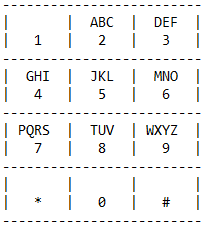

# Test_repository
Hello and welcome to the recruitment repository.

This task includes two exercises:

1. Task_1: Optimize and clean up the code. Not all of the classes are defined, so please stub it if You need. **The code should be buildable and tested.**

2. Task_2: Short exercise in Python:

Certainly, I'm familiar with the keyboard layout on old phones. For example, the one found in Nokia 3310 or Sony Ericsson K750i:

In those old models, to input a letter, you needed to press a specific button multiple times. For example, to get an A, you had to press button 2 once, and to get a Z, you had to press button 9 four times.
That's why, for instance, the word "CAT" would correspond to pressing the keys 22228.

Your task is to write a method that will convert any word into exactly such a sequence of digits. **Also mandatory is to test Your code using unittest or pyTest library.**

** **IMPORTANT** **

For both tasks, create one separate branch named "Solution" with two separate folders inside: Task_1 and Task_2.
